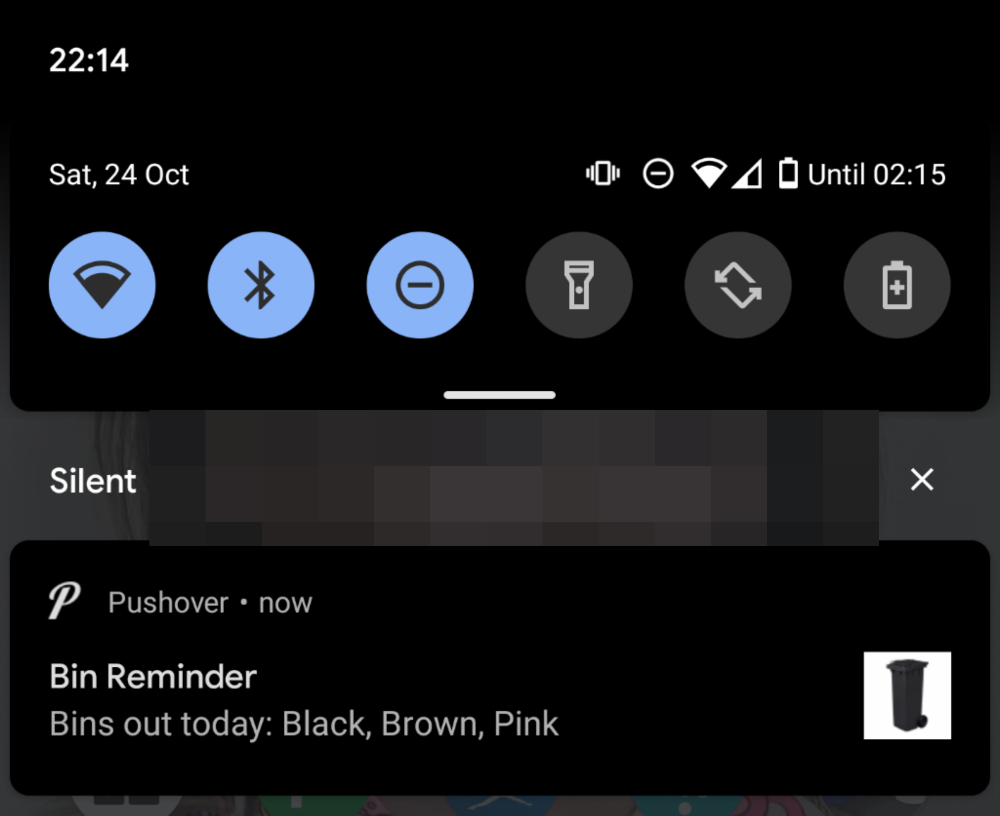
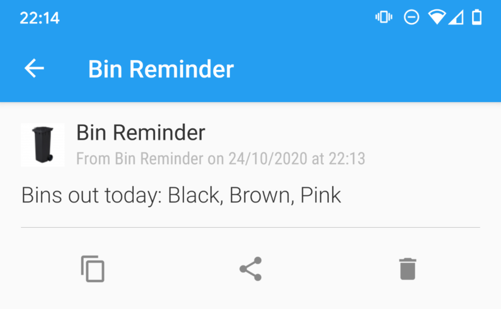

What Bin?
=========

This application will scrape your local council website and find out what bins you should put out tonight, for collection tomorrow, and send you a notification so you don't forget or have to look it up.

Comes with support for various notification options too. The author uses Pushover, but other providers should be easy enough to plug in.

## Usage

Create a YAML file with something like the following in the same directory as the binary, `/etc/whatbins/whatbins.yml` or `$HOME/.config/whatbins/whatbins.yml`:

```yaml
---
house_number: 42
postcode: M16 0RY

provider: salford
notifier: pushover

pushover_api_token: asdfasdfasdf
pushover_users:
  - qwertyqwertyqwerty
```

You can also set these config values as environment variables prefixed with `WHATBINS_`, e.g. `WHATBINS_HOUSE_NUMBER`.

You should run this application once per day, every day, so it can pick up changes to your bin collection days automatically, assuming the website gets updated. If no bins are due for collection then you'll receive no notifications. Cron will do nicely here.

## Supported Providers

This application can retrieve bins collection dates from the following councils:

* [Salford Council](https://www.salford.gov.uk) (provider: `salford`)
* [Your council here]

## Supported Notification Channels

* Stdout (notifier: `stdout`)
* Pushover (notifier: `pushover`)
* [Your preferred notification channel here]

## Screenshots



